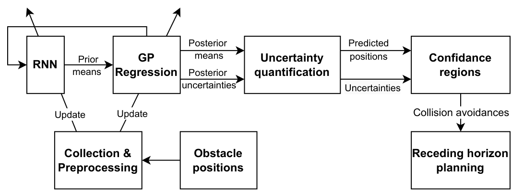

# DDDynObs

Dynamic obstacle avoidance simulations in Julia.

## Reference

[](figs/LEAP-O_dia.pdf)

## Setup

This project uses the Julia environment defined in [`src/Project.toml`](src/Project.toml) and locked by [`src/Manifest.toml`](src/Manifest.toml).

From the repository root:

```bash
julia --project=src -e 'using Pkg; Pkg.instantiate()'
```

## Run

Run the single-obstacle simulation:

```bash
julia --project=src src/Sim.jl
```

Run the multiple-obstacle simulation:

```bash
julia --project=src src/Sim_mobs.jl
```

## Output

Generated figures are written to `figs/`.
